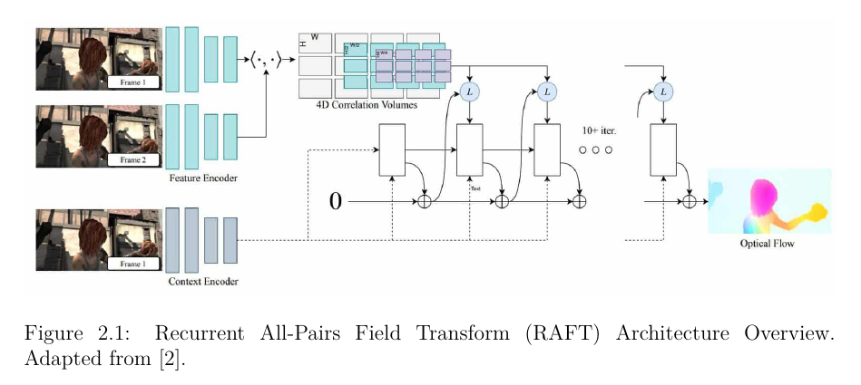
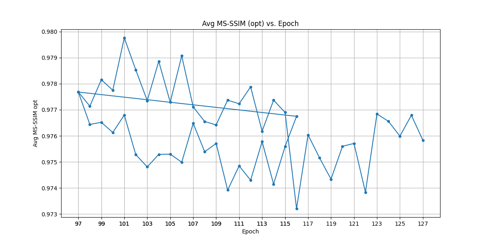
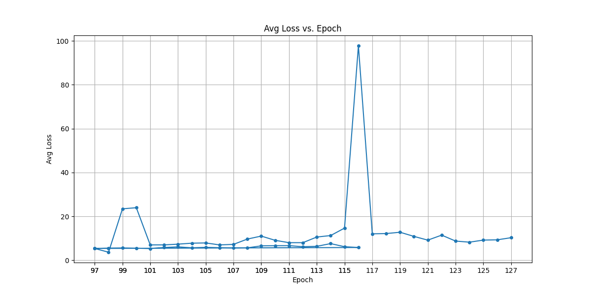
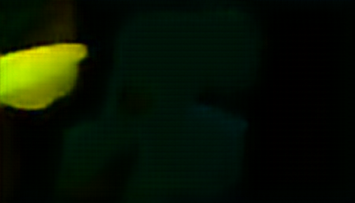
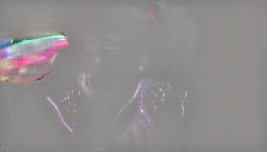

# RDVC: Raft Deep Video Compression

**A Hybrid Video Compression Framework combining RAFT Optical Flow, Hyperprior Entropy Coding, and Quantum-Inspired I-Frame Encoding (Not included in this repo).**


## Context

This repo implements **RDVC (Raft Deep Video Compression)**, a Final Year Project developed at **Talan Tunisie**  in collaboration with the **National School of Computer Science (ENSI)** .

The system addresses the limitations of traditional codecs by proposing a deep learning-based inter-frame compression pipeline. It integrates **RAFT** (Recurrent All-Pairs Field Transforms) for optical flow estimation and **Hyperprior Autoencoders** for entropy coding. Additionally, the project explores **Quantum Computing** simulations for I-frame compression. (NOT INCLUDED IN THIS REPOSITORY)

## Key Features

- **Learned Optical Flow (RAFT)**: Uses the RAFT architecture trained on MPI Sintel to estimate dense motion between frames, enabling effective motion compensation.
- **Motion Compensation Network (MCN)**: Refines warped frames to correct artifacts derived from occlusion or flow errors.
- **End-to-End Compression**:
  - **Motion Autoencoder**: Compresses optical flow maps using a hyperprior architecture.
  - **Residual Autoencoder**: Compresses residual errors (difference between predicted and actual frames).
- **Multi-Phase Training**: A strategy used to stabilize convergence and compensate for the low performance of the training hardware (My personal laptop):
  1.  **Phase 1**: Train Residual AE using Ground Truth flow (MSE loss).
  2.  **Phase 2**: End-to-end training with reconstructed flow.
  3.  **Phase 3**: Fine-tuning with perceptual loss (MS-SSIM) and Bitrate constraints.
- **Post-Processing**: Includes Low Motion Region replacement, Histogram Matching, and Temporal IIR Filtering to compensate for compression artifacts.
- **Custom File Format**: Encodes videos into `.rdvc` (RAFT Deep Video Compression) files.

## System Architecture & Workflows

The RDVC codec operates on a P-frame architecture involving Motion and Residual branches.

### High-Level Schematics
**Detailed Encoding Block Diagram:**


**Detailed Decoding Block Diagram:**


### Encoding & Decoding Processes
The system uses a synchronized loop to ensure the encoder and decoder states remain identical.

**Video Encoding Workflow:**


**Video Decoding Workflow:**


### Core Components
**RAFT Optical Flow Architecture:**


**Hyperprior Entropy Model:**


## Training & Optimization

### Training Dynamics
**RAFT Training:**


**Phase 1 Metrics (Initialization):**


**Phase 2 Metrics (End-to-End Loop):**


**Phase 3 Optimization (Perceptual Tuning):**
| MS-SSIM Optimization | Loss Convergence |
|:---:|:---:|
|  |  |

### Training Progression Visualization
Visualizing the model's output at the latest training epoch (Phase 3). This includes the motion compensation output and final reconstruction.


## Results & Evaluation

The system was evaluated on the **UVG Dataset** (Beauty, Jockey, ReadySetGo).

### Qualitative Reconstruction
Comparison between the original frame and the reconstructed frame after compression/decompression.

| Original Frame | Reconstructed Frame |
|:---:|:---:|
|  |  |


### Internal Representations
The model explicitly handles motion and residuals. Below are the reconstructed optical flow and residual maps.

| Reconstructed Optical Flow | Reconstructed Residual |
|:---:|:---:|
|  |  |

**RAFT Flow Prediction Sample:**


### Benchmarks
**Rate-Distortion Curves:**
| PSNR vs Bitrate | MS-SSIM vs Bitrate |
|:---:|:---:|
|  |  |

**Resolution Analysis:**
| PSNR by Resolution | MS-SSIM by Resolution |
|:---:|:---:|
|  |  |

### Post-Processing
**Temporal Filtering (First Order IIR):**


## Usage

### Prerequisites
- Python 3.11
- PyTorch (preferrably with CUDA enabled for GPU utilization)
- `compressai`
- `torchvision`, `numpy`, `opencv-python`, `pillow`, `tqdm`


The main entry point is **`codec_processing.py`** and supports two
modes: - `encode`: Input video → `.rdvc` bitstream - `decode`: `.rdvc`
bitstream → output video

All paths and most parameters are defined in `CodecConfig`. Selected
options can be overridden via CLI arguments.

------------------------------------------------------------------------

## General Syntax

``` bash
python codec_processing.py --mode {encode|decode} [OPTIONS]
```

------------------------------------------------------------------------

## Encoding (Video → `.rdvc`)

Encodes an input video into an `.rdvc` file.

### Minimal Command

Uses all defaults defined in `CodecConfig`:

``` bash
python codec_processing.py --mode encode
```

------------------------------------------------------------------------

### Specify GPU

Use a specific GPU:

``` bash
python codec_processing.py --mode encode --gpu 0
```

Force CPU execution:

``` bash
python codec_processing.py --mode encode --gpu -1
```

------------------------------------------------------------------------

### Select RAFT Backend

Choose which RAFT implementation to use for motion estimation:

``` bash
python codec_processing.py --mode encode --raft_backend auto
```

``` bash
python codec_processing.py --mode encode --raft_backend torchvision
```

``` bash
python codec_processing.py --mode encode --raft_backend local
```

------------------------------------------------------------------------

### Full Encoding Example

``` bash
python codec_processing.py \
    --mode encode \
    --gpu 0 \
    --raft_backend auto
```

------------------------------------------------------------------------

### Notes for Encoding

-   `config.input_file_path` must point to a valid input video.
-   Supported inputs include standard video formats (e.g. `.mp4`) and
    raw `.yuv`.
-   For `.yuv` input, the following **must be set in `CodecConfig`**:
    -   `input_yuv_width`
    -   `input_yuv_height`
    -   `input_yuv_fps`
    -   `input_yuv_pixel_format` (only `yuv420p` is supported)
-   The output bitstream location is defined by
    `config.output_rdvc_file`.

------------------------------------------------------------------------

## Decoding (`.rdvc` → Video)

Decodes an `.rdvc` file into a reconstructed video.

### Minimal Command

``` bash
python codec_processing.py --mode decode
```

------------------------------------------------------------------------

### Specify GPU

``` bash
python codec_processing.py --mode decode --gpu 0
```

Force CPU execution:

``` bash
python codec_processing.py --mode decode --gpu -1
```

------------------------------------------------------------------------

### Override Temporal Filtering (Decoder)

Adjust the temporal low-pass filter strength:

``` bash
python codec_processing.py --mode decode --temporal_filter_alpha 0.5
```

Valid range: `0.0` (no filtering) to `1.0` (maximum smoothing).

------------------------------------------------------------------------

### Full Decoding Example

``` bash
python codec_processing.py \
    --mode decode \
    --gpu 0 \
    --temporal_filter_alpha 0.7
```

------------------------------------------------------------------------

### Notes for Decoding

-   `config.input_rdvc_file` must point to an existing `.rdvc` file.
-   Output video path is defined by `config.output_video_path_decode`.
-   If `config.debug_frames_dir_decode` is set, decoded frames will be
    dumped to that directory.

------------------------------------------------------------------------

## CLI Arguments Summary

  -----------------------------------------------------------------------
  Argument                    Description
  --------------------------- -------------------------------------------
  `--mode`                    Operation mode: `encode` or `decode`
                              (required)

  `--gpu`                     GPU ID (`0`, `1`, ...) or `-1` for CPU

  `--raft_backend`            RAFT implementation (`auto`, `torchvision`,
                              `local`)

  `--temporal_filter_alpha`   Temporal smoothing factor for decoder


  ## Model Training (`new_train.py`)

The script `new_train.py` is responsible for training the RDVC neural video codec using a **3-phase training strategy**.  
All hyperparameters, paths, and training options are defined in the `TrainConfig` class.

There are **no mandatory command-line arguments**; training is started by executing the script directly.

---

### Training Command

`python new_train.py`

## Project Structure

- `codec_processing.py`: Core implementation of the `VideoCodec` class, including Encoders, Decoders, Warping layers, and Entropy Bottlenecks.
- `new_train.py`: The main training script implementing the 3-phase training loop utilizing `CompressAI`.
- `codec_checkpoints_*`: Directories storing model checkpoints.
- `training_plots/`: Stores metric plots generated during training.
- `visualization_*/`: Stores qualitative results (reconstructed frames, flow maps, residuals).
- `benchmark/`: Contains performance graphs, RD curves, and architecture diagrams.

If you want to train the models from scratch, you can use a pretrained RAFT model provided by the TorchVision library or refer to my older repository [RAFT](https://github.com/anis-hd/end2end.git) to train a RAFT model from scratch on the MPI Sintel dataset.

Always happy to collaborate.
